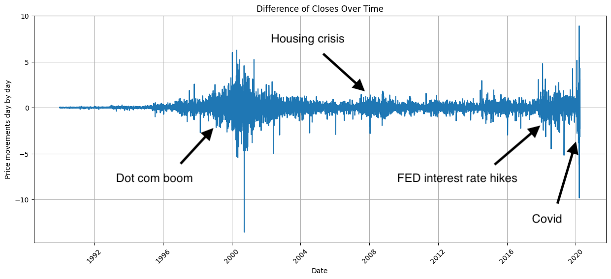

# profit_prophet_data_processing
Preprocessing data and creating stock market predictions with Tensorflow Keras

# Jupyter notebooks

`lstm.ipynb` is the notebook for creating the LSTM model, where plotting is happening and predicting prices.

`dense.ipynb` is a notebook for a feed-forward neural network with Dense layers, classification expects movement in one direction.

`classification.ipynb` is a notebook for a convolutional neural network for expecting movements up or down.

# Directory structure

As you can see in the .gitignore file, many directories have not been published to VCS, mainly because of their big size.
The following files are serving the purpose of creating an all-round model, that was unsuccessful, but I've learned a lot:

- `main.py`
- `main_lstm.py`
- `main_train_test_aggregate.py`
- `main_train_test_scale.py`
- `main_train_test_split.py`

As data is stationary I tried processing the step-by-step, that is why I have these files.

I used the following structure for local development, as you cannot see them on any of the VCS:

- All the csv raw data are stored in tha `.\data` folder
- The data needs to be split into training and testing sets, I split the dataset with
a `test_size=0.2` with scikit learn library, and turned shuffle off

- training data is stored in `.\data_train`
- testing data is stored in `.\data_test`
- until now all stocks are stored separately
- now the data needed to be aggregated to one file to be able to feed the neural network all at once:
in `.\data_test\aggregated` and `.\data_train\aggregated` I aggregated all the data to one file while converting
all data to numbers: datetime relative in days to `1970-01-01`, adding a ticker field to be able to separate stocks
and adding an `Is Stock` boolean field (0 or 1)
- after aggregating all the data to files, for further preprocessing I needed to scale data to eliminate biases from different sizes of values

# Patterns

Not only neural networks, we also can explore certain patterns with our own eyes with good visualization.

*big movements during difficult times*
